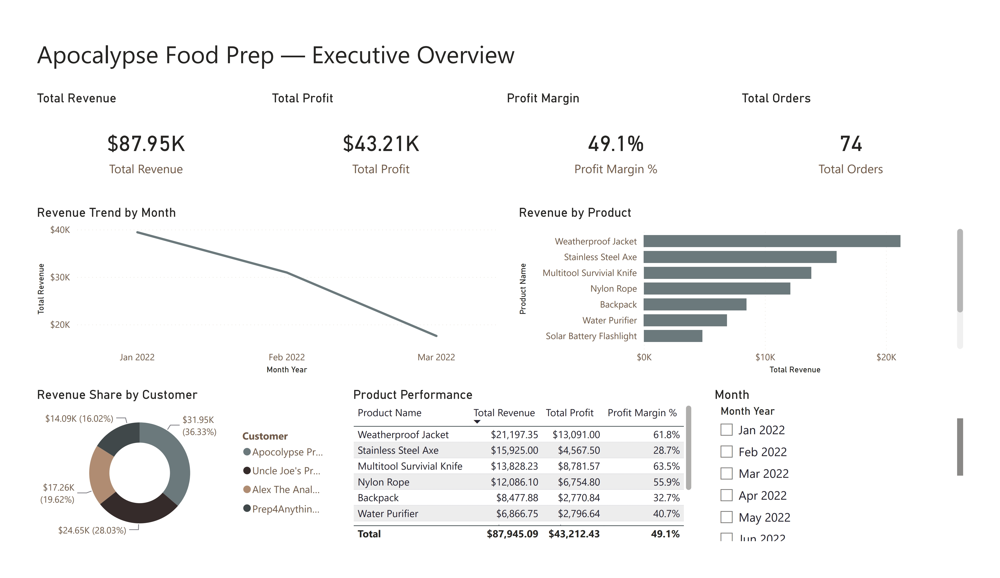

# Apocalypse Food Prep, Power BI

A four-page Power BI report built from a single flat sales export: 3,001 units sold to 4 customers between January and March 2022.

## Key findings

- Revenue fell every month: $39,426.89 in January, $30,938.89 in February, $17,579.31 in March.
- Margin barely moved over the same stretch, 49.3% to 49.4% to 48.2%, so the drop is a volume problem, not a pricing or cost one.
- The Weatherproof Jacket sold the fewest units of the top six products but earned the most profit, a 61.8% margin against 28.7% for the Stainless Steel Axe on similar revenue.

This is a training dataset (the "Apocalypse Food Prep" exercise), so the point of this repo is the modelling and report-building workflow, not a live business result.

## What's in this repo

- `Apocalypse Dashboard.pbip`, `Apocalypse Dashboard.Report/`, `Apocalypse Dashboard.SemanticModel/`: the Power BI project in the modern PBIP format. Star schema on ID joins, a `Date` calculated table, and a 17-measure `Key Measures` table. Four report pages: Executive Overview, Product Profitability, Customer Insights, Sales Trend.
- `apocalypse-dashboard.pdf`: a static export of all report pages.

## Full write-up

The complete case study is on my portfolio: [ghostiemoh.com](https://ghostiemoh.com/#work)
